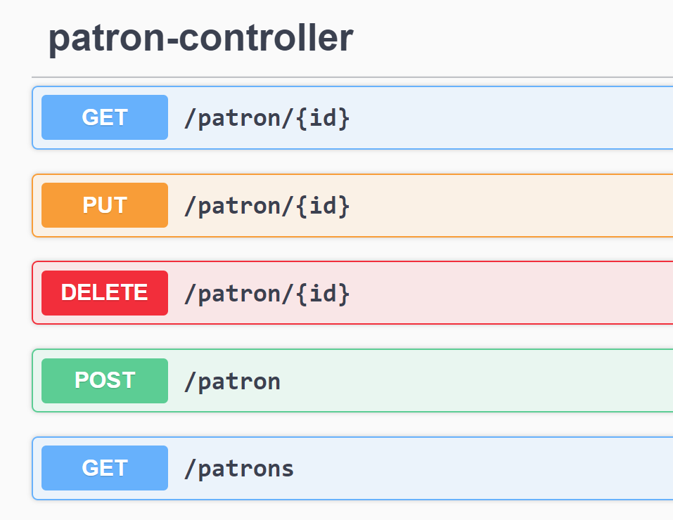
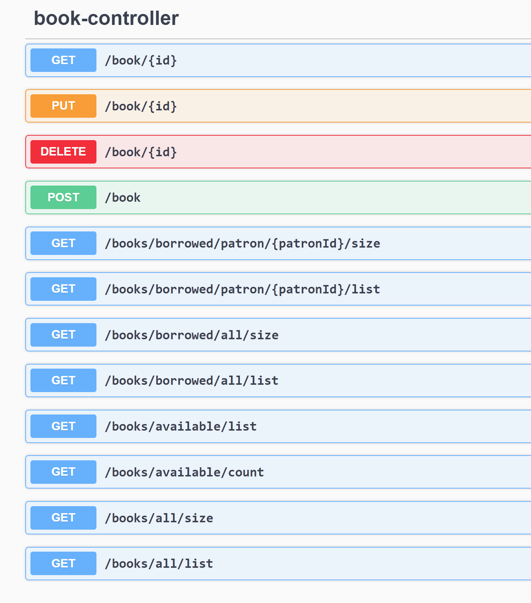
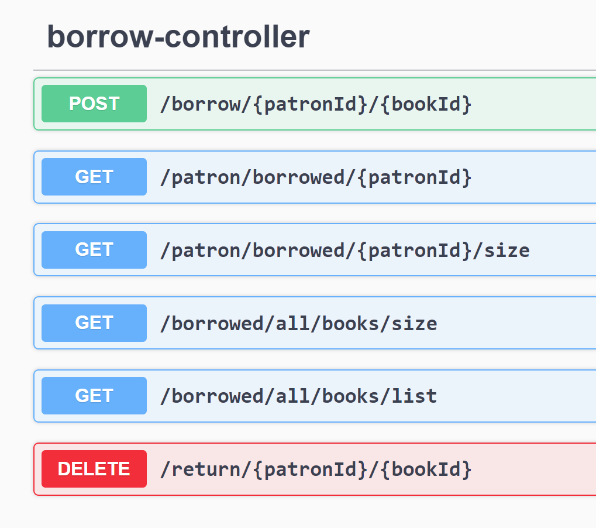
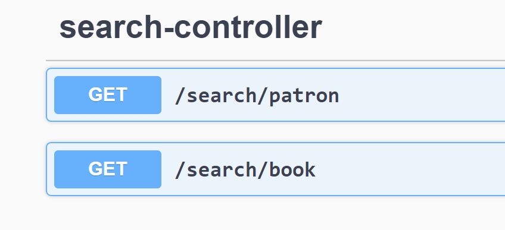

##Note: Document not shown correctly due to special characters. Open HELP.md file in text editor
(Typo of ISBN with ISAN in code field)

# Application - Book Store 

### Features
* Manage User/Patron - Create, Update, Delete, List out, Find, Advance Search
* Manage Books - Create, Update, Delete, List out, Find, Advance Search
* Borrow and Return - Book against Patron

### Due to limited time - What is not implemented?
* Input validation; Checks if records exits in datasource before operation
* Not written/added loggers, unit-test case, documentation
* Have not set spring profile, for default data load (Configuration bean LoadDatabase.class can be used for pre-load data)
* HELIOS standard API response
* Exception handling in all places

### What is available?
* ( Default port is 8080 )
* swagger-ui location: http://localhost:8080/swagger-ui/index.html
* h2-ui  location: http://localhost:8080/h2-ui 
* * H2 username/password configured in resources/application.properties

### What is disabled?
* Spring-security- Enable it by uncommenting dependency from pom.xml

##  How to run/launch?
* From root Directory run cmd :  'mvnw clean spring-boot:run'

### Launch
* http://localhost:8080
* Open swagger-ui to interact with API : http://localhost:8080/swagger-ui/index.html

#Status:
Available.
* Search books using fields such as title or ISBN. 
  *     API - 
        search/books 
        - input> 
        name:title
        isab:ISBN
  *  Bonus points for the advanced search of title using 'like' string or 'exact' string. For example
users can search for books having title like 'potter'.
    *      API  -
           search/books
            - input>
            name:pot*
            name:*ter
            name:*tte*
* Search total number of books currently available in the library.
  *         API - 
            books/available/list
            books/available/count
  * Bonus points for the advanced search of searching specific book quantity available in library.
  *          Available quantity shown against each book record, 
             total quantity, borrowed quantity - as well
    
* Search total number of borrowed books. 
  *      API - 
        books/borrowed/all/list 
        books/borrowed/all/size
    * Bonus points for advanced search to find total books borrowed by a specific patron.
  *     API - 
        books/borrowed/patron/{patronId}/list
        books/borrowed/patron/{patronId}/size
    

# Advance search behaviour
# input search text expected of format 
'< FIELD>< OPERATOR>< VALUE> | < FIELD>< OPERATOR>< VALUE> '

##1. Field - are the Database column names
##2. Operator
":" - for EQUALITY  - Value (e.g. shashank) supports startsWith ('sha*'), EndsWith ('*ank'), Contains ('*han*')

">" - for GREATER THAN

"<" - for SMALLER THAN

##3. Value - the seach terms

### e.g. 
name:My*

name:*My*

name:My* | cost<3

API: search/book and search/patron

1. search/book - sample search query input  (values based on your data load): 
name:My* | cost<50 | isan:*a*

2. search/patron - sample search query input (values based on your data load):
name:*au*
   

## To manage Patron uses services end points
- 

## To manage Books uses services end points
- 

## To borrow or return book use services end points
- 

## To do advance search on Book or Patron use services end points
- 

